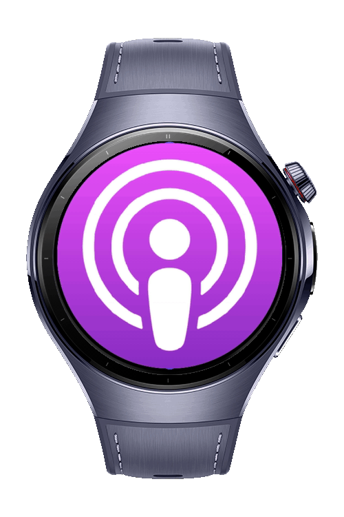
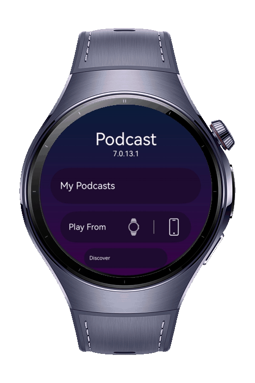
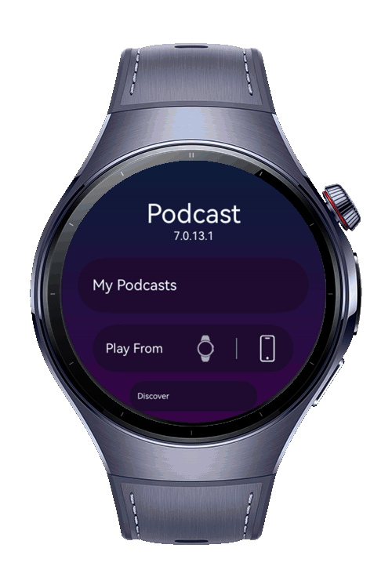

> **Note:** To access all shared projects, get information about environment setup, and view other guides, please visit [Explore-In-HMOS-Wearable Index](https://github.com/Explore-In-HMOS-Wearable/hmos-index).

# Podcast Wearable Application

Welcome to **Podcast Wearable**, a lightweight reference application that demonstrates how to deliver a smooth, battery-friendly podcast experience on smartwatch-class devices. Built with modern wearable-first design principles, the project showcases:
This app is intentionally kept small and framework-agnostic so you can lift individual patterns—like circular progress indicators, haptic gestures, or background playback bindings—into your own projects. Clone, run, and explore the code to see best practices for handling media on wearables without compromising performance or user comfort.

# Preview

<div>
  
  
  
  
</div>

# Use Cases

## 1. Splash Page

A lightweight launch screen that instantly shows the app logo, brand colors, and a tiny loading spinner while the player engine and episode database finish warming up. It provides a seamless hand-off to the main experience without noticeable lag, assuring the user that the watch hasn’t frozen.

## 2. Podcast Text Tracker

Displays a scrolling transcript that stays perfectly in sync with the audio. Each word or sentence is auto-highlighted as it’s spoken, and the scroll speed can be adjusted for slower or faster listeners. Ideal for quiet environments or accessibility scenarios where reading along enhances comprehension.

## 3. Discover

A curated exploration hub where users can browse trending shows, filter by genre, and dive into editor’s picks—all optimized for glanceable wearable UIs. Smart recommendations learn from play history and surface fresh episodes in a single tap, reducing the time it takes to find your next listen.

## 4. Podcast Player

The core playback interface with oversized play/pause, skip, and rewind controls tailored for round screens and quick thumb access. It supports haptic feedback, a circular progress indicator, Bluetooth headset controls, and seamless background audio so episodes keep playing when the screen sleeps.


# Tech Stack

* **Languages:** ArkTS, ArkUI
* **Frameworks:** HarmonyOS SDK 5.1.0
* **Tools:** DevEco Studio 5.1.0
* **Libraries:** @kit.ArkUI

# Constraints and Restrictions

## Supported Device

* Huawei Watch 5

# Directory Structure

```
├── features
│   ├── discover
│   ├── downloads 
│   ├── favorites 
│   ├── genres 
│   ├── landing 
│   ├── mainlist 
│   ├── player 
│   ├── search 
│   ├── settings 
│   ├── splash 
│   
├── utils
    ├── commons 
    ├── generalutils 
```

# LICENSE

**Podcast Watch App** is distributed under the terms of the MIT License.
See the [LICENSE](/LICENSE) for more information.
